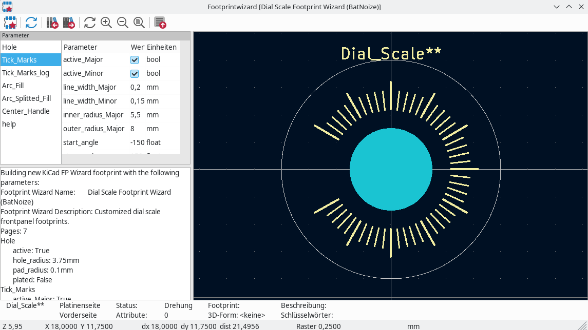
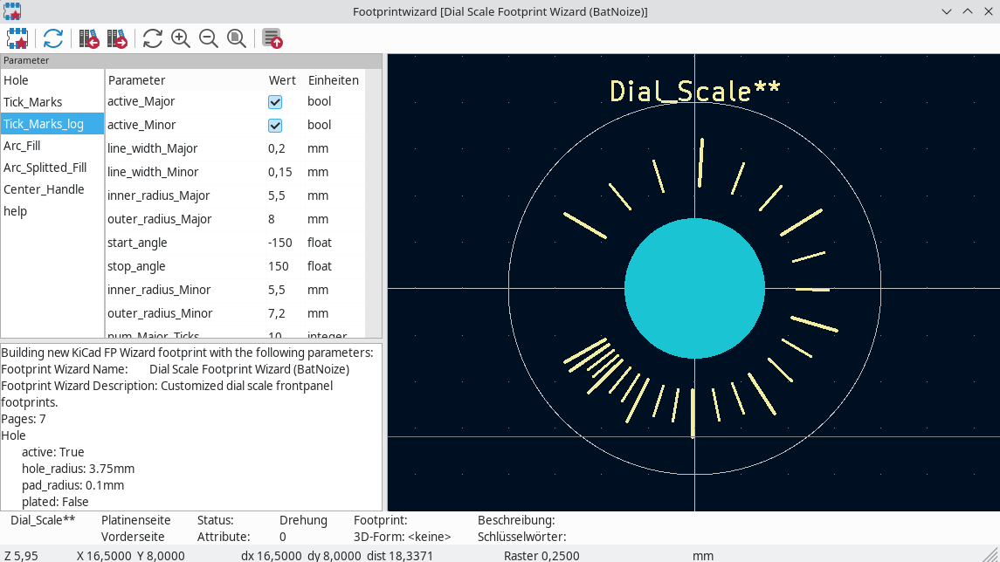
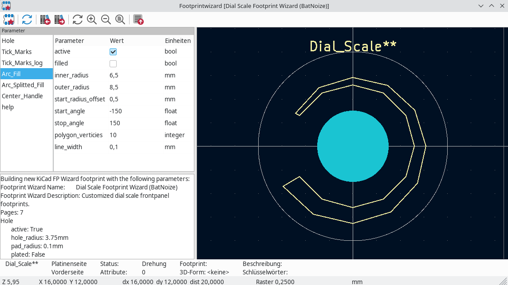
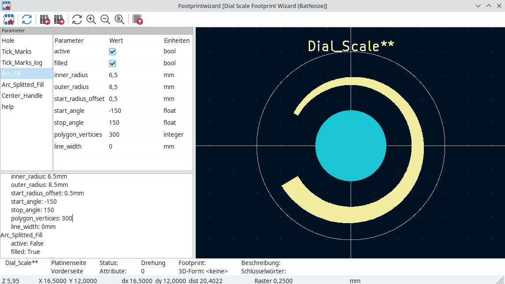
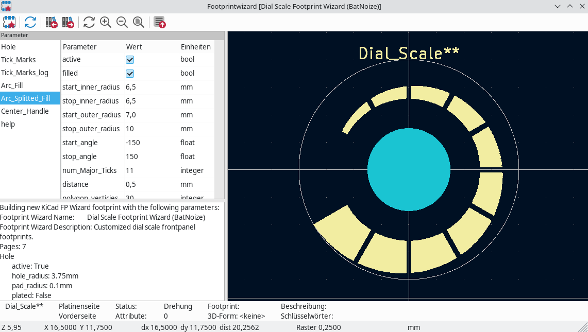
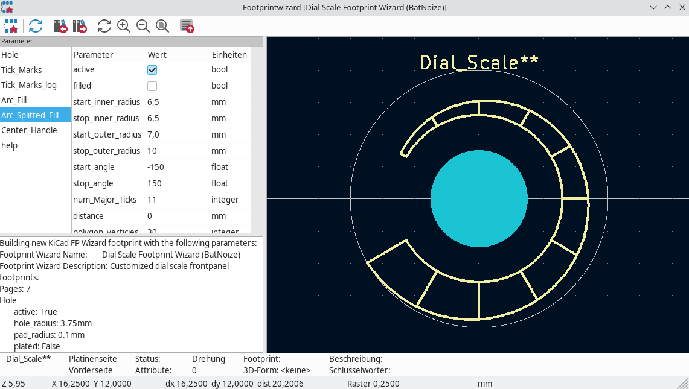

### Tick Marks

Tick_Marks Settings:
- active_Major: True
- active_Minor: True
- line_width_Major: 0.2mm
- line_width_Minor: 0.15mm
- inner_radius_Major: 5.5mm
- outer_radius_Major: 8mm
- start_angle: -150
- stop_angle: 150
- inner_radius_Minor: 5.5mm
- outer_radius_Minor: 7.2mm
- num_Major_Ticks: 11
- num_Minor_Ticks: 4

<table>
  <tr>
    <td>Tick Marks demo 1</td> <td> Settings </td></tr>
  <tr><td rowspan="2" width=65%></td> <td>
- active_Major: True 
- active_Minor: True 
- line_width_Major: 0.2mm 
- line_width_Minor: 0.15mm 
- inner_radius_Major: 5.5mm 
- outer_radius_Major: 8mm 
- start_angle: -150 
- stop_angle: 150 
- inner_radius_Minor: 5.5mm 
- outer_radius_Minor: 7.2mm 
- num_Major_Ticks: 11 
- num_Minor_Ticks: 4
</td> </tr>
</table>

### Log Tick Marks

Tick_Marks_log Settings:
- active_Major: True
- active_Minor: True
- line_width_Major: 0.2mm
- line_width_Minor: 0.15mm
- inner_radius_Major: 5.5mm
- outer_radius_Major: 8mm
- start_angle: -150
- stop_angle: 150
- inner_radius_Minor: 5.5mm
- outer_radius_Minor: 7.2mm
- num_Major_Ticks: 10
- num_Minor_Ticks: 4
- invert_scale: False
- log_Minor: False
- skip_Minor_Ticks_by_degree: 2

### Arc not filled

Arc_Fill Settings:
- active: True
- filled: False
- inner_radius: 6.5mm
- outer_radius: 8.5mm
- start_radius_offset: 0.5mm
- start_angle: -150
- stop_angle: 150
- polygon_verticies: 10
- line_width: 0.1mm

### Arc filled

Arc_Fill Settings:
- active: True
- filled: True
- inner_radius: 6.5mm
- outer_radius: 8.5mm
- start_radius_offset: 0.5mm
- start_angle: -150
- stop_angle: 150
- polygon_verticies: 300
- line_width: 0mm

### Arc splitted filled

Arc_Splitted_Fill Settings:
- active: True
- filled: True
- start_inner_radius: 6.5mm
- stop_inner_radius: 6.5mm
- start_outer_radius: 7.0mm
- stop_outer_radius: 10mm
- start_angle: -150
- stop_angle: 150
- num_Major_Ticks: 11
- distance: 0.5mm
- polygon_verticies: 30
- line_width: 0.0mm

### Arc splitted w.o. fill

Arc_Splitted_Fill Settings:
- active: True
- filled: False
- start_inner_radius: 6.5mm
- stop_inner_radius: 6.5mm
- start_outer_radius: 7.0mm
- stop_outer_radius: 10mm
- start_angle: -150
- stop_angle: 150
- num_Major_Ticks: 11
- distance: 0mm
- polygon_verticies: 30
- line_width: 0.2mm