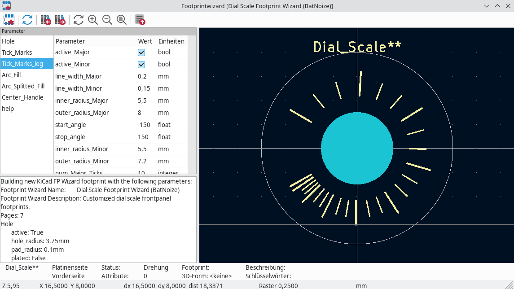

# The Dial Scale Footprint Wizard

**The Dial Scale Footprint Wizard** is a tool that allows users to generate customized dial scale footprints for KiCad.

## Examples

Menu was changed, demo is not up to date

## Plugin Installation Instructions

To install the plugin, follow these steps:

- **Download the latest release**: Get the plugin's .zip file from its release page.
- **Open the Plugin and Content Manager**: In KiCad, navigate to the Plugin and Content Manager.
- **Install from file**: Click on the "Install from File..." button and select the downloaded plugin .zip file.
- **Verify installation**: The plugin will now appear under the "Installed" tab.
- **Close the Manager**: Close the Plugin and Content Manager window.

## Using the Plugin

After installation, you can use the plugin to create a footprint:

- **Open the Footprint Editor**: Open the KiCad Footprint Editor to create a new footprint.
- **Launch the Wizard**: Start the "Dial Scale Footprint Wizard" from the menu or toolbar to generate your footprint.

## Usage
Users can input various parameters in the dialog to define the characteristics of the dial scale, such as hole configuration, tick marks, arc fill, center handle, and help circle for orientation. The wizard groups the parameters under different categories for easy navigation and customization.

Here is an overview of the parameters that can be defined in the dialog:
### Hole:
- ``Active``: Enable or disable the hole feature.
- ``Hole Radius``: Specify the radius of the hole.
- ``Pad Radius``: Set the radius of the pad around the hole.
- ``Plated``: Choose whether the hole should be plated or not.
### Tick Marks:
- ``Active Major``: Enable or disable major tick marks.
- ``Active Minor``: Enable or disable minor tick marks.
- ``Line Width Major``: Set the line width for major tick marks.
- ``Line Width Minor``: Set the line width for minor tick marks.
- ``Inner Radius Major``: Define the inner radius for major tick marks.
- ``Outer Radius Major``: Define the outer radius for major tick marks.
- ``Start Angle``: Specify the starting angle for the tick marks.
- ``Stop Angle``: Specify the stopping angle for the tick marks.
- ``Inner Radius Minor``: Define the inner radius for minor tick marks.
- ``Outer Radius Minor``: Define the outer radius for minor tick marks.
- ``Num Major Ticks``: Set the number of major tick marks.
- ``Num Minor Ticks``: Set the number of minor tick marks.
### Arc Fill:
- ``Active``: Enable or disable the arc fill feature.
- ``Filled``: Choose whether the arc should be filled or not.
- ``Inner Radius``: Specify the inner radius of the arc.
- ``Outer Radius``: Specify the outer radius of the arc.
- ``Start Radius Offset``: Specify the start radius offset.
- ``Start Angle``: Specify the starting angle for the arc.
- ``Stop Angle``: Specify the stopping angle for the arc.
- ``Polygon Vertices``: Set the number of vertices for the polygon.
- ``Line Width``: Set the line width for the arc fill.
### Arc Splitted Fill:
- ``Active``: Enable or disable the arc fill feature.
- ``Filled``: Choose whether the arc should be filled or not.
- ``Start Inner Radius``: Specify the start inner radius of the arc.
- ``Stop Inner Radius``: Specify the stop inner radius of the arc.
- ``Start Outer Radius``: Specify the start outer radius of the arc.
- ``Stop Outer Radius``: Specify the stop outer radius of the arc.
- ``Start Angle``: Specify the starting angle for the arc.
- ``Stop Angle``: Specify the stopping angle for the arc.
- ``Num Major Ticks``: Set the number of major tick marks.
- ``Distance``: Set the cap of major tick marks in mm.
- ``Polygon Vertices``: Set the number of vertices for the polygon.
- ``Line Width``: Set the line width for the arc fill.
### Center Handle:
- ``Active``: Enable or disable the center handle feature.
- ``Line Width``: Set the line width for the center handle.
- ``Inner Radius``: Define the inner radius for the center handle.
- ``Outer Radius``: Define the outer radius for the center handle.
- ``Angle``: Specify the angle for the center handle.
### Help:
- ``Active``: Enable or disable the help feature.
- ``Circle Radius``: Specify the radius of the help circle.
- ``Line Width``: Set the line width for the help features.

The BuildThisFootprint function generates the geometry of the footprint based on the defined parameters. It creates the dial scale with features such as radial lines, tick marks, arc fill, center handle, and help circle. The wizard provides a user-friendly interface for designing and customizing dial scale footprints for PCB layouts.

## Examples

### Tick Marks

Tick_Marks Settings:
- active_Major: True
- active_Minor: True
- line_width_Major: 0.2mm
- line_width_Minor: 0.15mm
- inner_radius_Major: 5.5mm
- outer_radius_Major: 8mm
- start_angle: -150
- stop_angle: 150
- inner_radius_Minor: 5.5mm
- outer_radius_Minor: 7.2mm
- num_Major_Ticks: 11
- num_Minor_Ticks: 4

### Log Tick Marks

Tick_Marks_log Settings:
- active_Major: True
- active_Minor: True
- line_width_Major: 0.2mm
- line_width_Minor: 0.15mm
- inner_radius_Major: 5.5mm
- outer_radius_Major: 8mm
- start_angle: -150
- stop_angle: 150
- inner_radius_Minor: 5.5mm
- outer_radius_Minor: 7.2mm
- num_Major_Ticks: 10
- num_Minor_Ticks: 4
- invert_scale: False
- log_Minor: False
- skip_Minor_Ticks_by_degree: 2

### Arc not filled

Arc_Fill Settings:
- active: True
- filled: False
- inner_radius: 6.5mm
- outer_radius: 8.5mm
- start_radius_offset: 0.5mm
- start_angle: -150
- stop_angle: 150
- polygon_verticies: 10
- line_width: 0.1mm

### Arc filled

Arc_Fill Settings:
- active: True
- filled: True
- inner_radius: 6.5mm
- outer_radius: 8.5mm
- start_radius_offset: 0.5mm
- start_angle: -150
- stop_angle: 150
- polygon_verticies: 300
- line_width: 0mm

### Arc splitted filled

Arc_Splitted_Fill Settings:
- active: True
- filled: True
- start_inner_radius: 6.5mm
- stop_inner_radius: 6.5mm
- start_outer_radius: 7.0mm
- stop_outer_radius: 10mm
- start_angle: -150
- stop_angle: 150
- num_Major_Ticks: 11
- distance: 0.5mm
- polygon_verticies: 30
- line_width: 0.0mm

### Arc splitted filled

Arc_Splitted_Fill Settings:
- active: True
- filled: False
- start_inner_radius: 6.5mm
- stop_inner_radius: 6.5mm
- start_outer_radius: 7.0mm
- stop_outer_radius: 10mm
- start_angle: -150
- stop_angle: 150
- num_Major_Ticks: 11
- distance: 0mm
- polygon_verticies: 30
- line_width: 0.2mm